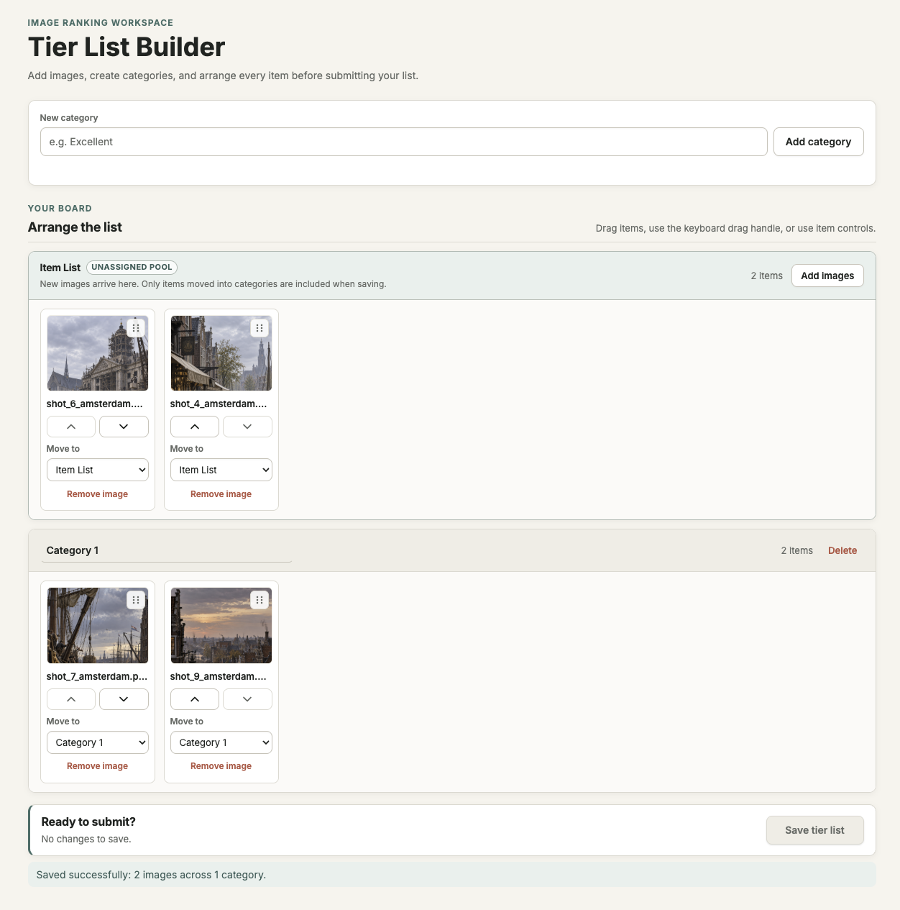

# Tier List Builder

A React and TypeScript take-home for importing images, organizing them into ranked
categories, and submitting the categorized subset as multipart form data.



## Quick start

### Option A — Docker (recommended for reviewers)

```bash
docker build -t tier-list-builder .
docker run --rm -p 8080:8080 tier-list-builder
```

Open [http://localhost:8080](http://localhost:8080). The container includes the
built frontend and demonstration multipart receiver, so Save works without another
service.

### Option B — Local development

Requires Node.js 22+ and npm.

```bash
npm ci
npm run dev
```

Open [http://localhost:5173](http://localhost:5173). Vite serves the frontend and
mounts the same receiver at `/api/tier-lists`.

### Run the production build locally

```bash
npm run build
npm start
```

Open [http://localhost:8080](http://localhost:8080).

## Suggested review path

1. Add or drop several image files into the Unassigned Pool.
2. Create categories and move items with drag-and-drop, the arrow buttons, or the
   destination select.
3. Rename and delete a category. Deleted-category items return to the pool.
4. Save with at least one categorized image. Images left in the pool are excluded
   from the submission.
5. Inspect the `POST /api/tier-lists` request in DevTools to see the multipart
   payload and file parts.

## Checks

```bash
npm run typecheck
npm run lint
npm test
npm run build
```

## Submission contract

The browser posts multipart form data to `/api/tier-lists`. It contains one JSON
field plus one binary part for each categorized image:

```text
payload = {"categories":[{"name":"A","items":["image_<item-id>"]}]}
image_<item-id> = <binary image file>
```

Field names use generated item IDs, so duplicate filenames do not collide. The
browser sets `Content-Type` and its multipart boundary. The included receiver checks
that JSON references and uploaded fields match, then returns a `201` summary. It does
not persist data.

To target another API at build time:

```bash
VITE_TIER_LIST_API_URL=https://api.example.com/tier-lists npm run build
```

For Docker:

```bash
docker build \
  --build-arg VITE_TIER_LIST_API_URL=https://api.example.com/tier-lists \
  -t tier-list-builder .
```

## Project map

- `src/domain` — pure tier-list transitions and invariants
- `src/features/tier-list` — React components and controller hook
- `src/infrastructure` — multipart serialization and API client
- `server` — demonstration receiver and production static server

## Product rules

- New images enter the Unassigned Pool; only `image/*` files are accepted.
- Category names are trimmed, cannot be empty, and may be duplicated.
- Save requires at least one category and one categorized image.
- Unassigned images remain in the workspace and are not submitted.
- Deleting a category returns its images to the pool in their existing order.
- Editing is disabled while a save request is in progress. Failed requests preserve
  the board; successful unchanged submissions cannot be repeated.

State is intentionally in memory. See [DECISIONS.md](./DECISIONS.md) for architecture,
scope, trade-offs, and the development workflow.
